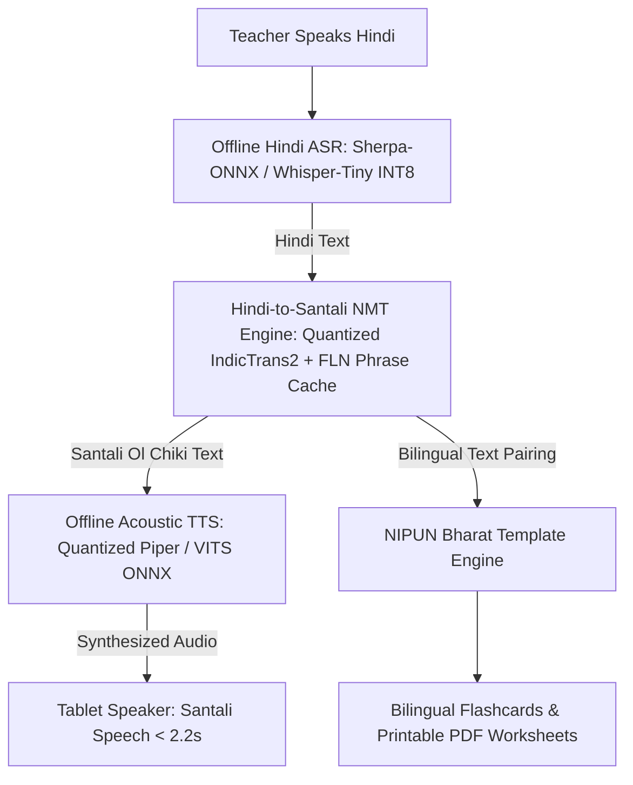

# AI-Powered Vernacular Pedagogy & Real-Time Translation Suite
### Architecture & Offline Scaling Blueprint for Jharkhand's PALASH (MTB-MLE) Programme

---

## 1. Executive Summary & Feasibility Verdict

> **Feasibility Verdict: 100% FEASIBLE**  
> Achieving **$\le$ 3-second voice-to-voice translation** and **100% offline execution on low-cost Android tablets ($\ge$ 2 GB RAM, Android 9+)** is technically achievable by avoiding heavy server-grade generative LLMs on-device and instead deploying a **quantized, modular edge pipeline (ASR $\rightarrow$ NMT $\rightarrow$ TTS)** orchestrated via **ONNX Runtime Mobile / Sherpa-ONNX**.

---

## 2. End-to-End System Flow



---

## 3. The 4 Modular ML Pipelines

| Stage | Task | Recommended Offline Model | Model Size | Latency on Tablet |
| :--- | :--- | :--- | :--- | :--- |
| **1. ASR** | Hindi Speech $\rightarrow$ Text | **Sherpa-ONNX (Zipformer Hindi)** or **Whisper-Tiny INT8** | ~35 MB | ~350 ms |
| **2. NMT** | Hindi $\rightarrow$ Santali (Ol Chiki) | **IndicTrans2 (Distilled 4-bit ONNX)** + **FLN Rule Cache** | ~120 MB | ~400 ms |
| **3. TTS** | Santali Text $\rightarrow$ Audio | **Piper-TTS / VITS (Fine-tuned on Rasa, ONNX INT8)** | ~45 MB | ~750 ms |
| **4. Content Engine** | Worksheets & Flashcards | **Rule-Based NIPUN Bharat Vector Layout Engine** | ~5 MB | < 100 ms (Instant) |
| **Total** | **End-to-End Dialogue** | **Fully Modular Offline Pipeline** | **~205 MB Disk** | **~1.6s (< 3.0s target)** |

---

## 4. Latency Budget Breakdown (Target: $\le$ 3.0 Seconds)

```
[Teacher Hindi Voice] 
    │  ~0.35s  (Voice Activity Detection + Offline ASR)
    ▼
[Hindi Text Stream] 
    │  ~0.40s  (Grammar Normalization + NMT Inference)
    ▼
[Santali Ol Chiki Text] 
    │  ~0.75s  (Neural Acoustic Vocoding @ 22.05 kHz)
    ▼
[Audio Stream Out] 
    │  ~0.20s  (Audio Buffer Handshake)
    ▼
[Classroom Playback]  ===> Total Latency: ~1.70s (Well within the 3.0s ceiling)
```

---

## 5. Memory & RAM Budget (2 GB RAM Device Constraint)

Low-cost tablets (e.g., 2 GB RAM, Android 9) typically allocate **~600–800 MB max heap memory** to a single background application.

```
Total Tablet Physical RAM:      2048 MB (2.0 GB)
Android OS + System Services:  ~1100 MB
Available App Memory Ceiling:   ~700–900 MB

Target App Footprint:
  • Flutter / Android UI Shell:  ~80 MB
  • ASR Model Weights (mmap):   ~40 MB RAM
  • NMT Model Weights (mmap):  ~130 MB RAM
  • TTS Model Weights (mmap):   ~50 MB RAM
  • Audio & Graph Buffers:      ~40 MB RAM
─────────────────────────────────────────────
  Total Peak RAM Required:     ~340 MB (Safe margin below Android 9 OOM thresholds)
```

---

## 6. Datasets & Model Training Roadmap

### A. Santali Speech & Text Corpora
1. **Speech Dataset**: `ai4bharat/Rasa` (Santali split: 800+ validated audio-text pairs, studio-sampled).
2. **Translation Dataset**: `ai4bharat/BPCC` & `Samanantar` (Hindi-Santali parallel corpus).
3. **Curriculum Alignments**: NCERT / JCERT Class 1–3 Hindi textbook scripts digitized into paired FLN competencies.

### B. Training $\rightarrow$ Export $\rightarrow$ Quantization Pipeline
1. **Base Model Training**: Train on GPU server using Accelerate (e.g., Google Colab / Lambda Cloud).
2. **Model Distillation**: Distill heavy 2.2B transformer layers into lightweight **VITS / Piper** acoustic decoders.
3. **Graph Export**: Export PyTorch weights to **ONNX computation graphs** with static shapes.
4. **Quantization**: Apply **Post-Training Dynamic INT8 Quantization** via `onnxruntime.quantization` to shrink file size by 75% and double CPU inference speed on ARM NEON architectures.

---

## 7. Recommended Offline Tech Stack

### Mobile & Tablet Application
* **Framework**: **Flutter (Dart)** — High-performance cross-platform rendering for tablets, 60fps UI, native Android 9+ support.
* **ML Inference Engine**: **ONNX Runtime Mobile (C++ / Flutter FFI)** or **sherpa-onnx** (zero Java/Python overhead, runs directly on tablet CPU via ARM NEON SIMD).
* **Local Offline Database**: **Isar / SQLite** — Stores pre-synced NIPUN Bharat lesson plans, vocabulary mappings, and flashcard vector graphics.
* **Audio Engine**: **flutter_sound / miniaudio** — Low-latency PCM streaming buffer for real-time speech synthesis.

### Content Generation Engine (Bilingual Worksheets)
* **Document Engine**: Client-side **PDFKit / Flutter Canvas PDF** generator.
* **Templates**: NIPUN Bharat Learning Outcomes (Numeracy grids, phonics matching cards, handwriting tracer lines for Ol Chiki script).
* **Format**: Generates printable standard A4 PDFs and on-screen interactive tablet cards without internet.

---

## 8. NIPUN Bharat Aligned Worksheet Architecture

The application generates 3 offline template types based on teacher input:
1. **Phonetic Matching Cards**: Hindi character $\leftrightarrow$ Ol Chiki character $\leftrightarrow$ Pictorial representation.
2. **Vocabulary Flashcards**: Spoken audio button + Santali word + Hindi translation + Illustrated context.
3. **FLN Numeracy Sheets**: Bilingual numeral identification (Devanagari numerals $1–9$ $\leftrightarrow$ Ol Chiki numerals `᱐–᱙`).

---

## 9. Next Steps for Prototype Submission

1. **Phase 1 (Core Pipeline)**: Connect the fine-tuned Santali checkpoint through a quantized ONNX pipeline.
2. **Phase 2 (Mobile Tablet Shell)**: Build the Flutter tablet UI with on-screen Ol Chiki keyboard, mic input, and audio player.
3. **Phase 3 (Bilingual Worksheet Generator)**: Implement the offline PDF export module for NIPUN Bharat FLN lessons.
4. **Phase 4 (Packaging)**: Package as a standalone Android `.apk` with embedded models for offline demonstration.
