# Offline AI Vernacular Pedagogy & Speech Translation Suite
## Complete Architecture & System Flowcharts (Hindi ➔ Ho / Mundari / Santali)

---

## 1. Master Architecture

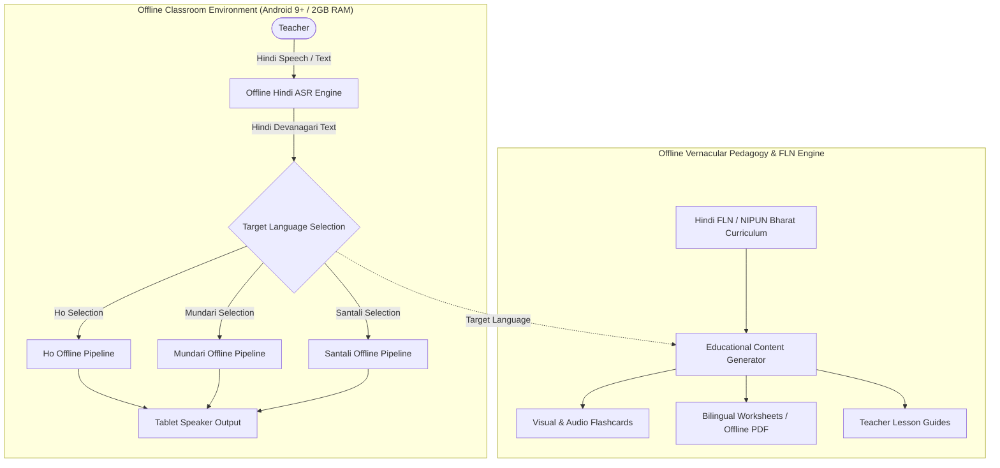

---

## 2. Complete ML Pipeline

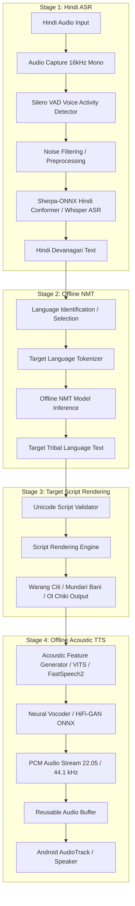

---

## 3. Hindi ASR Pipeline

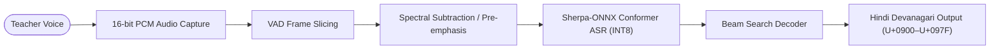

---

## 4. Ho Translation & Synthesis Pipeline

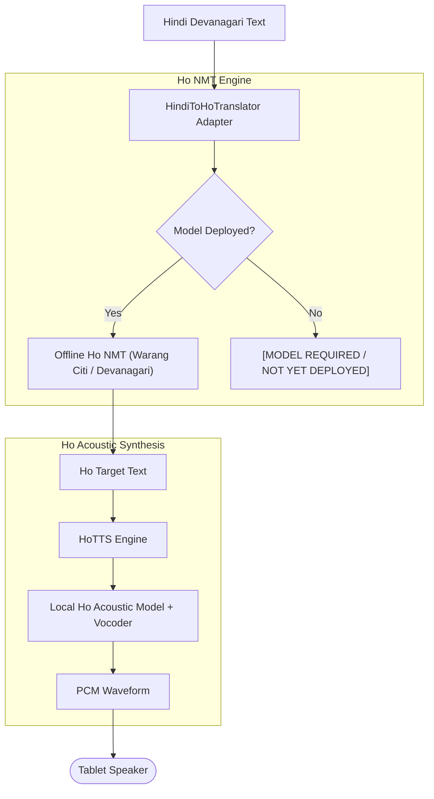

---

## 5. Mundari Translation & Synthesis Pipeline

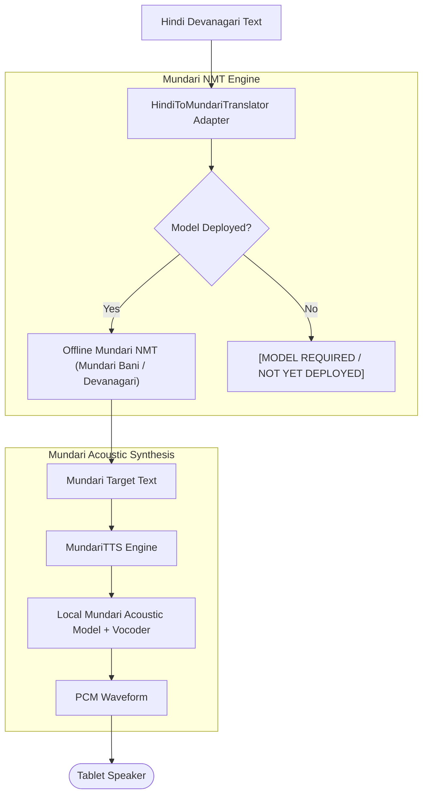

---

## 6. Santali Translation & Synthesis Pipeline

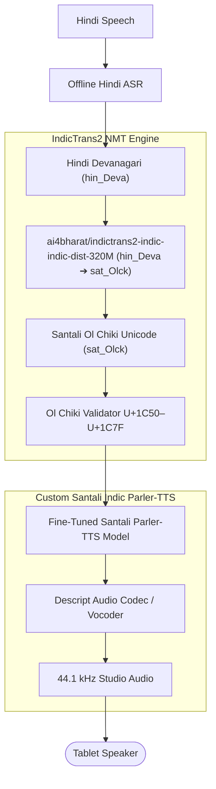

---

## 7. Translation Model Abstraction Architecture

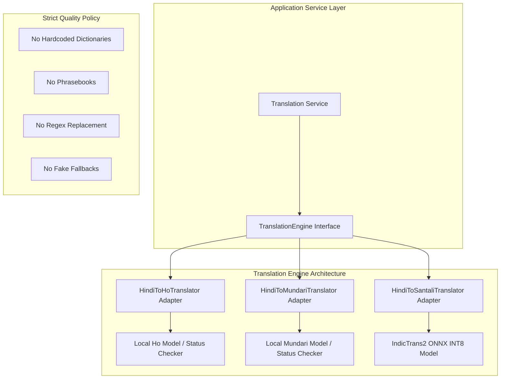

---

## 8. TTS Manager Abstraction Architecture

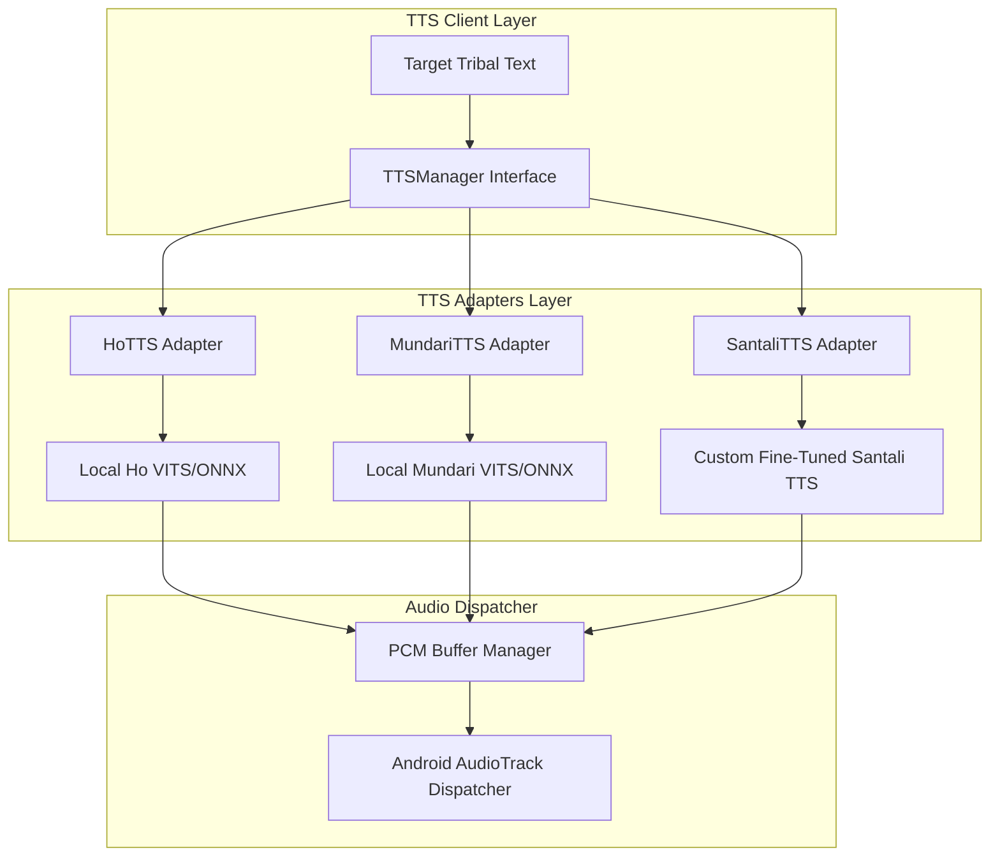

---

## 9. Real-Time Voice-to-Voice Latency Flow

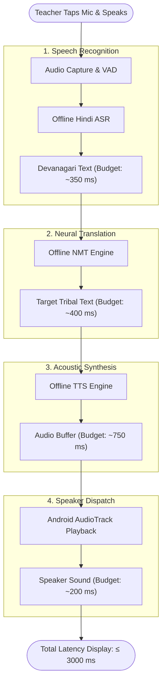

---

## 10. FLN Curriculum Generation Pipeline

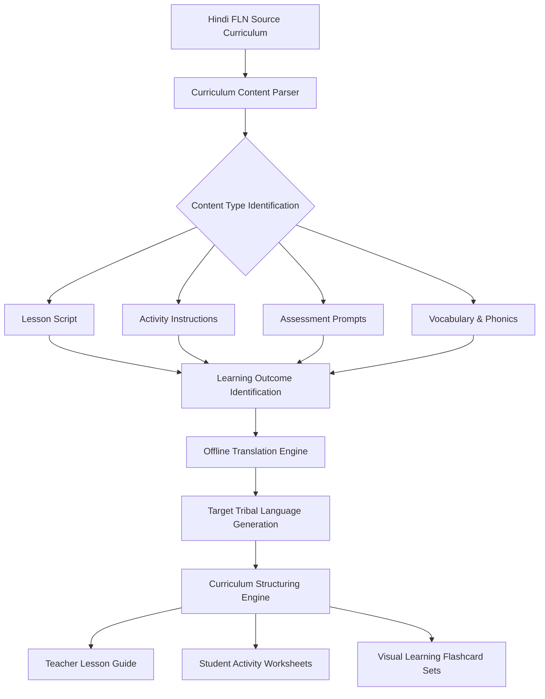

---

## 11. NIPUN Bharat Pedagogical Alignment Flow

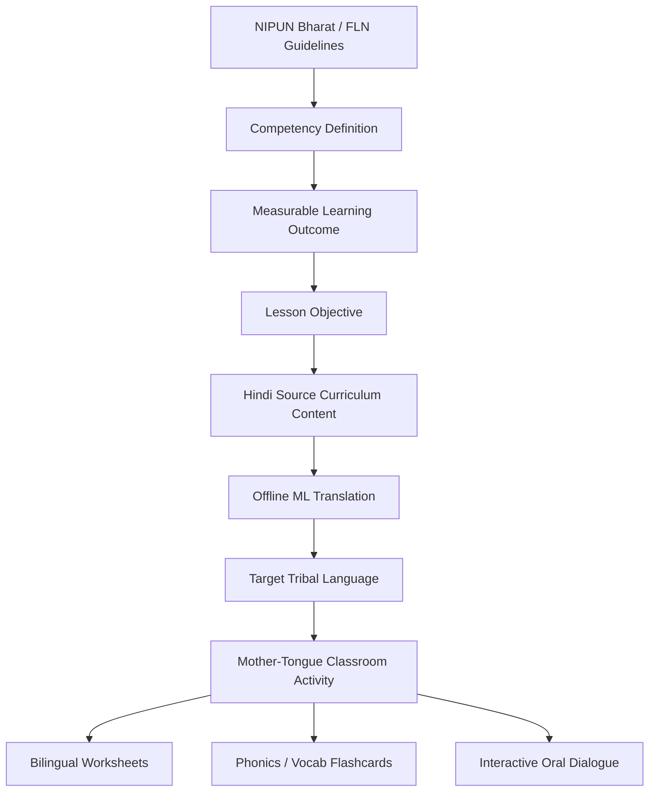

---

## 12. Bilingual Worksheet Generation Pipeline

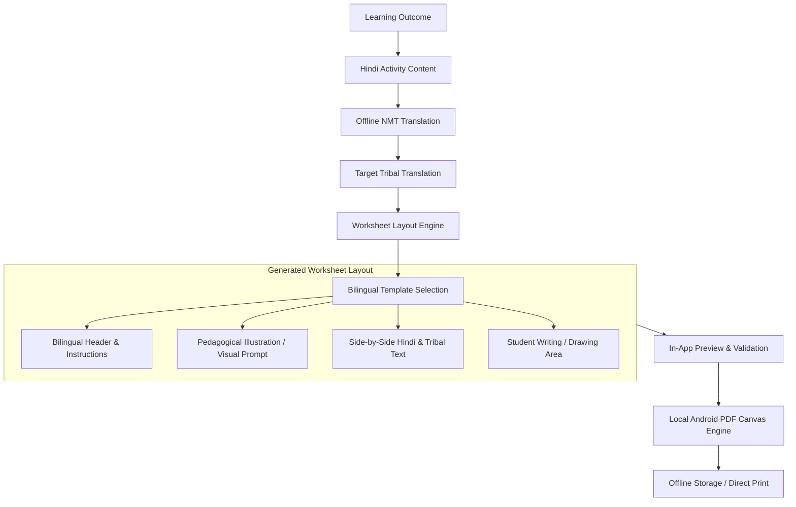

---

## 13. Visual Flashcard Generation Pipeline

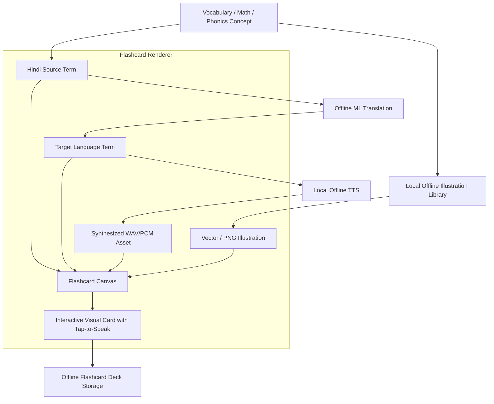

---

## 14. Visual Flashcard Types

```mermaid
flowchart TD
    subgraph Type1 ["1. Vocabulary Flashcard"]
        V1[Hindi Word] --> V2[Target Tribal Word] --> V3[Illustration] --> V4[Audio Button]
    end

    subgraph Type2 ["2. Phonetics Flashcard"]
        P1[Hindi Letter / Akshar] --> P2[Tribal Script Glyph] --> P3[Phonetic Visual] --> P4[Sound Match Exercise]
    end

    subgraph Type3 ["3. Numeracy Flashcard"]
        N1[Devanagari Numeral] --> N2[Tribal Numeral / Script] --> N3[Visual Quantity / Counters] --> N4[Counting Task]
    end

    subgraph Type4 ["4. Classroom Objects Flashcard"]
        C1[Classroom Instruction / Item] --> C2[Tribal Translation] --> C3[Real-World Icon] --> C4[Pronunciation Guide]
    end
```

---

## 15. Worksheet Types Matrix

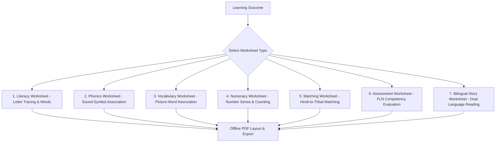

---

## 16. Offline Content Synchronization Flow

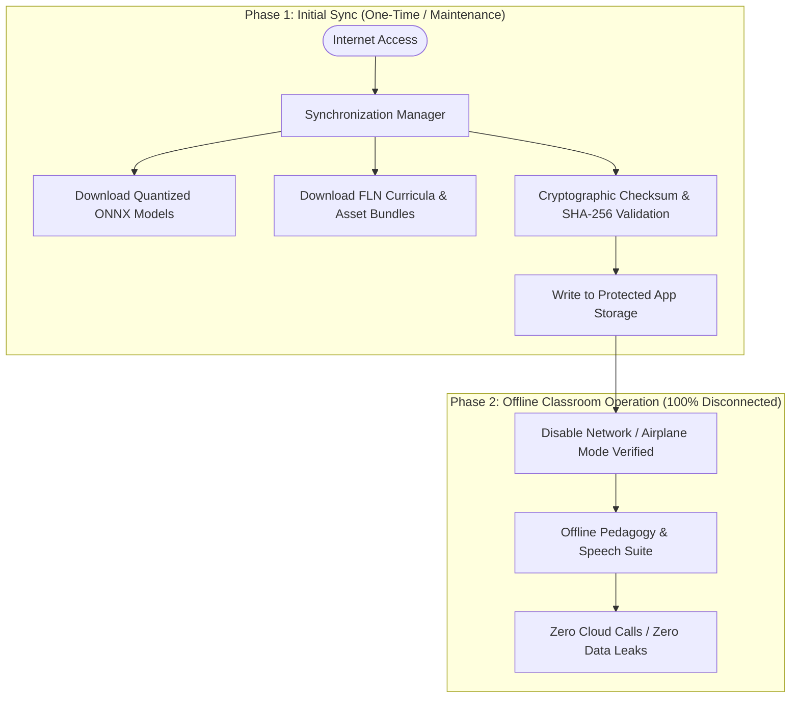

---

## 17. Offline Runtime Architecture

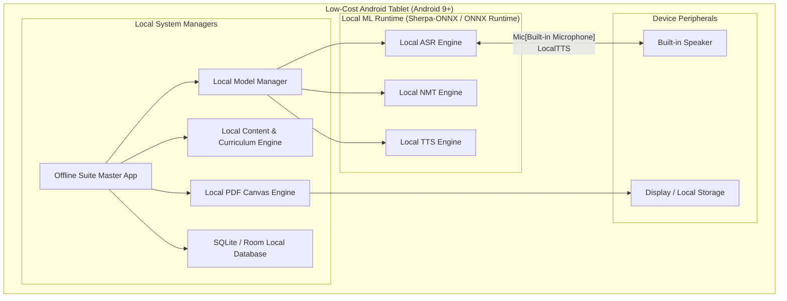

---

## 18. 2 GB RAM Device Architecture & Dynamic Memory Flow

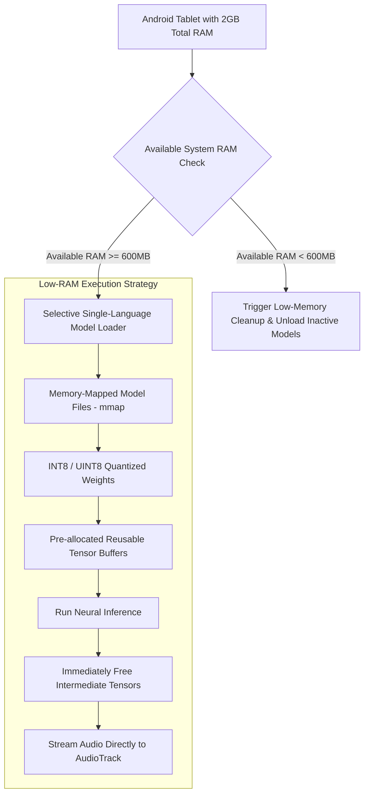

---

## 19. Latency Optimization Workflow

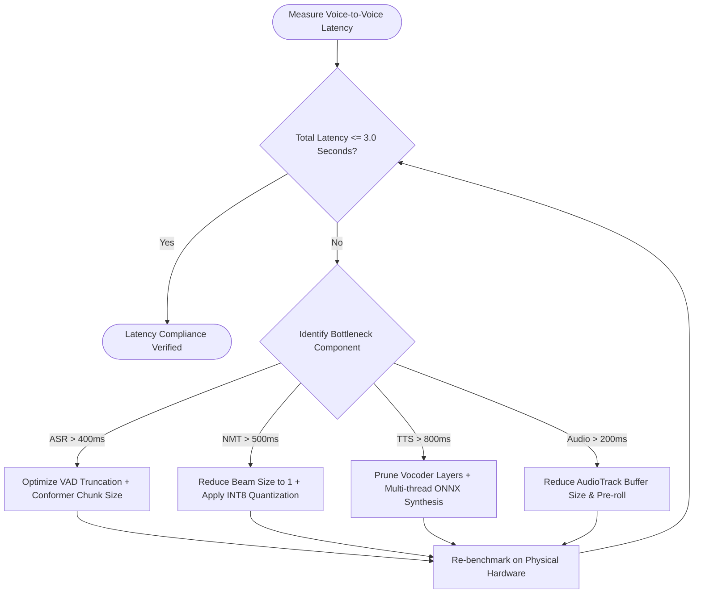

---

## 20. Memory Optimization Workflow

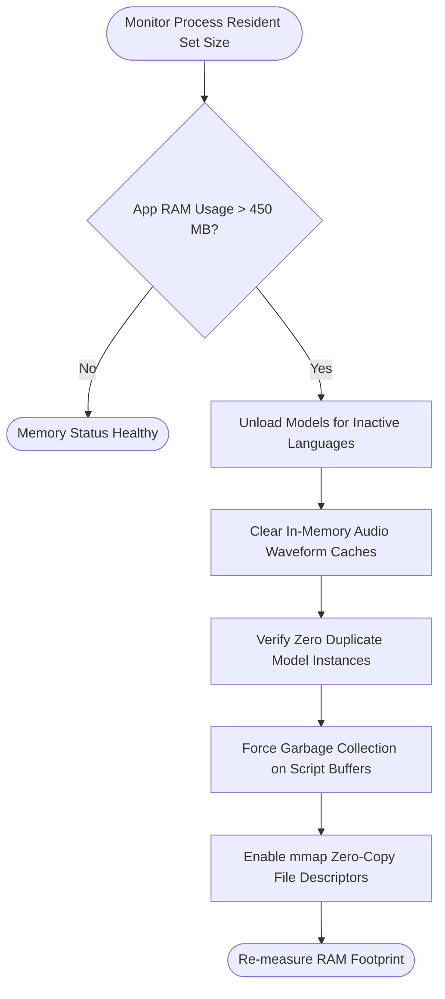

---

## 21. Model Development to Mobile Export Pipeline

```mermaid
flowchart LR
    DevPyTorch[PyTorch / Transformers Model in GPU Environment] --> TorchScript[Export to TorchScript / FX Graph]
    TorchScript --> ONNXGraph[Export to Standard ONNX Graph]
    ONNXGraph --> Simplifier[ONNX-Simplifier Graph Optimization]
    Simplifier --> QuantEngine[INT8 Dynamic / Static Quantization]
    QuantEngine --> MobileValidate[Verify Numerical Output vs PyTorch FP32]
    MobileValidate --> SherpaPkg[Bundle into Mobile ONNX Asset Package]
```

---

## 22. Model Quantization Pipeline

```mermaid
flowchart TD
    FP32[FP32 Model Weights ~1.2 GB] --> Calibration[Representative Calibration Dataset - IndicCorp]
    Calibration --> QuantMethod{Quantization Approach}
    
    QuantMethod --> WeightOnly[Dynamic INT8 Weight-Only Quantization]
    QuantMethod --> FullQuant[Static INT8 Weight + Activation Quantization]
    
    WeightOnly & FullQuant --> CompModel[INT8 Quantized Model ~300 MB]
    CompModel --> AccuracyCheck{WER / BLEU Degradation < 1.5%?}
    
    AccuracyCheck -- Yes --> DeployModel[Approved for 2GB RAM Deployment]
    AccuracyCheck -- No --> FineTuneQuant[Quantization-Aware Training QAT]
    FineTuneQuant --> CompModel
```

---

## 23. On-Device Privacy & Data Boundary

```mermaid
flowchart LR
    subgraph OnDeviceBoundary ["100% On-Device Execution (Android Sandbox)"]
        TeacherSpeech([Teacher Voice]) --> Mic[Microphone]
        Mic --> RAM[Volatile RAM Only]
        RAM --> ASR[Local ASR]
        ASR --> NMT[Local NMT]
        NMT --> TTS[Local TTS]
        TTS --> Speaker[Device Speaker]
    end

    subgraph ExternalWorld ["External Network / Cloud"]
        CloudServer[Cloud Servers]
        ThirdParty[Third-Party APIs]
    end

    RAM -.->|BLOCKED: Zero Data Transmission| CloudServer
    RAM -.->|BLOCKED: No Telemetry / No Logging| ThirdParty
```

---

## 24. Comprehensive Error Handling Matrix

```mermaid
flowchart TD
    Input([User Input Received]) --> C1{Device Compatible? Android 9+ / RAM OK}
    C1 -- No --> E1[Display System Requirements Warning]
    C1 -- Yes --> C2{Selected Language Model Deployed?}
    
    C2 -- No --> E2["Display 'MODEL REQUIRED / NOT YET DEPLOYED'"]
    C2 -- Yes --> C3{ASR Capture & Decoding Successful?}
    
    C3 -- No --> E3[Prompt Teacher to Repeat Speech]
    C3 -- Yes --> C4{NMT Translation Returned Valid Tokens?}
    
    C4 -- No --> E4[Display Translation Engine Failure Alert]
    C4 -- Yes --> C5{Unicode Target Script Validation Passed?}
    
    C5 -- No --> E5[Display Target Script Rendering Error]
    C5 -- Yes --> C6{Acoustic TTS Synthesis Successful?}
    
    C6 -- No --> E6[Display Audio Synthesis Failure Alert]
    C6 -- Yes --> Output([Stream Audio & Render Bilingual Text])
```

---

## 25. Teacher Dashboard Navigation Architecture

```mermaid
flowchart TD
    Home([Teacher Dashboard Home]) --> Tab1[1. Real-Time Translation]
    Home --> Tab2[2. FLN Curriculum Planner]
    Home --> Tab3[3. Visual & Audio Flashcards]
    Home --> Tab4[4. Bilingual Worksheets]
    Home --> Tab5[5. Offline Library & Sync]
    Home --> Tab6[6. Device Diagnostics & Benchmark]
```

---

## 26. Real-Time Translation Screen Flow

```mermaid
flowchart TD
    Screen[Open Real-Time Translation Screen] --> SelectLang[Select Target: Ho / Mundari / Santali]
    SelectLang --> LoadModel[Lazy-Load Target Model into Memory]
    
    LoadModel --> ReadyState[Status: READY / Latency: 0ms]
    ReadyState --> TapMic[Tap Microphone Button]
    
    TapMic --> Record[Record Hindi Audio & Run VAD]
    Record --> ASRState[ASR Decoding: Display Hindi Devanagari]
    ASRState --> NMTState[NMT Decoding: Display Target Tribal Script]
    NMTState --> TTSState[TTS Generation: Stream Target Audio]
    
    TTSState --> DisplayMetrics["Display Real Metrics:\nASR: 340ms | NMT: 390ms | TTS: 720ms | Total: 1450ms"]
```

---

## 27. Curriculum Screen Flow

```mermaid
flowchart TD
    Start[Open Curriculum Screen] --> SelectClass[Select Class: 1 / 2 / 3]
    SelectClass --> SelectSubject[Select Subject: Literacy / Numeracy / EVS]
    SelectSubject --> SelectCompetency[Select NIPUN FLN Competency]
    SelectCompetency --> SelectLO[Select Learning Outcome]
    
    SelectLO --> LoadHindiCurriculum[Load Structured Hindi Lesson Content]
    LoadHindiCurriculum --> TriggerTranslate[Trigger Offline NMT Engine]
    TriggerTranslate --> ShowBilingual[Display Side-by-Side Lesson & Teacher Prompts]
```

---

## 28. Flashcard Screen Flow

```mermaid
flowchart TD
    Start[Open Flashcards Screen] --> SelectTopic[Select Topic / Vocabulary Unit]
    SelectTopic --> SelectTargetLang[Select Target Language]
    SelectTargetLang --> CardGen[Generate Flashcard Deck]
    
    CardGen --> CardView[Display Card: Hindi + Tribal + Illustration]
    CardView --> AudioTap[Tap Speaker Icon]
    AudioTap --> PlayTTS[Play On-Demand Offline Synthesized Audio]
    CardView --> SaveDeck[Save Deck to Offline Library]
```

---

## 29. Worksheet Screen Flow

```mermaid
flowchart TD
    Start[Open Worksheet Screen] --> SelectLO[Select Learning Outcome & Activity Type]
    SelectLO --> SelectFormat[Select Layout: Tracing / Matching / Math / Story]
    SelectFormat --> SelectLang[Select Target Language]
    
    SelectLang --> BuildSheet[Execute Offline Translation & Layout Engine]
    BuildSheet --> PreviewSheet[Interactive Bilingual Worksheet Preview]
    PreviewSheet --> EditPrompts[Optional Teacher Edit of Instructions]
    EditPrompts --> ExportPDF[Export Print-Ready Offline PDF]
```

---

## 30. Offline Library Flow

```mermaid
flowchart TD
    Library[Open Offline Library] --> CatSelector{Select Category}
    
    CatSelector --> Cat1[Lesson Guides]
    CatSelector --> Cat2[Audio Flashcard Decks]
    CatSelector --> Cat3[Saved PDF Worksheets]
    
    Cat1 --> ViewGuide[Read Bilingual Guides Offline]
    Cat2 --> PlayDeck[Review & Play Audio Offline]
    Cat3 --> SharePrint[Print via Local Wi-Fi Direct / Bluetooth]
```

---

## 31. Development to Production Environment Isolation

```mermaid
flowchart LR
    subgraph DevEnv ["Development & Training Environment (Cloud / Colab / Workstation)"]
        GPU[NVIDIA T4 / A100 GPUs]
        Train[Model Training & Fine-Tuning]
        Weights[Raw FP32 PyTorch Checkpoints]
        Tokens[Hugging Face / API Credentials]
        Export[ONNX INT8 Export & Optimization]
    end

    subgraph PackageBuild ["Build & Packaging Stage"]
        Clean[Strip Secrets & Credentials]
        Verify[Verify Zero Cloud Dependencies]
        Bundle[Bundle ONNX Models + SQLite Curriculum + Assets]
        APK[Compile Android Release APK]
    end

    subgraph ProdEnv ["Production Runtime (Classroom Tablets)"]
        APK --> Install[Install on Android 9+ 2GB Device]
        Install --> OfflineApp[100% Offline Runtime]
    end

    DevEnv --> PackageBuild
```

---

## 32. Final Acceptance Verification Flow

```mermaid
flowchart TD
    A[Install Production APK on Android 9+ 2GB RAM Tablet] --> B[Perform Initial One-Time Sync & Download]
    B --> C[Physically Turn Off Wi-Fi & Mobile Data]
    C --> D[Launch App in Airplane Mode]
    
    D --> E{Offline Health Check}
    E --> F[Test Hindi Voice Input ➔ ASR]
    F --> G[Test IndicTrans2 Santali NMT]
    G --> H[Test Custom Santali TTS Audio Playback]
    H --> I[Verify Total Latency <= 3.0 Seconds]
    I --> J[Verify Peak Process RAM < 450 MB]
    J --> K[Generate Bilingual Worksheet & Export PDF]
    K --> L[Generate Visual Flashcard & Play Audio]
    L --> M{All Criteria Met?}
    
    M -- Yes --> PASS([VERIFICATION PASSED: Production Classroom Ready])
    M -- No --> FAIL([VERIFICATION FAILED: Review Logs & Remediate])
```

---

## 33. Architectural Responsibility Boundaries

| System Responsibility | Component Owner | Implementation Scope | Strict Architectural Boundary |
| :--- | :--- | :--- | :--- |
| **Content Rules** | `CurriculumManager`, `LearningOutcomeManager` | NIPUN Bharat competencies, grade levels, worksheet schemas, card layout rules | Contains zero translation logic and zero audio synthesis code. |
| **Linguistic Translation** | `TranslationEngine`, Model Adapters | `IndicTrans2` (Santali), Offline Ho NMT, Offline Mundari NMT | Pure neural sequence-to-sequence translation. No hardcoded dictionaries or phrasebook fallbacks allowed. |
| **Speech Synthesis** | `TTSManager`, Voice Engines | Custom Santali Indic Parler-TTS, Ho TTS, Mundari TTS | Converts validated phonetic/Unicode text to acoustic waveforms. Does not perform language translation. |
| **User Interface** | Dashboard, Presentation Views | Real-Time Translator, Flashcard Viewer, PDF Renderer | Handles display, audio playback, touch controls, and latency metric reporting. |
