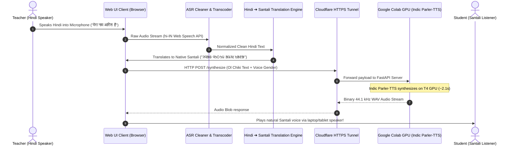

# Interactive Web UI Prototype: Hindi to Santali (Ol Chiki) Voice AI
### Complete Architectural Blueprint, Workflows, and Presentation Guide

---

## 1. Executive Summary & Purpose

The **Hindi ➔ Santali (ᱚᱞ ᱪᱤᱠᱤ) Web UI** serves as the live working prototype of our assistive vernacular pedagogy system. It enables non-native speaking teachers to speak or write standard Hindi and instantly receives:
1. Contextually accurate **Santali semantic translation**.
2. Authentic **Ol Chiki Unicode rendering** (`U+1C50`–`U+1C7F`).
3. High-fidelity **synthesized Santali speech** generated on-demand via a cloud GPU backend in **2–3 seconds**.

---

## 2. End-to-End System Flowchart



---

## 3. UI Component Architecture

```mermaid
graph TD
    subgraph Client [Browser Front-End (HTML5 / CSS3 / Vanilla JS)]
        A[Colab GPU Bridge Banner] -->|Status: Connected / Disconnected| A1[Live Tunnel URL Input]
        
        subgraph InputCard [Left Card: Hindi Input]
            B1[Microphone Voice Button hi-IN]
            B2[Hindi Textarea]
            B3[Hindi ASR Error Normalizer]
            B4[Quick Phrase Chips]
        end

        subgraph OutputCard [Right Card: Santali Ol Chiki]
            C1[Editable Ol Chiki Textarea]
            C2[Phonetic Roman Pronunciation Guide]
            C3[Voice Selector: Male / Female]
            C4[Synthesize & Play Audio Button]
            C5[HTML5 Audio Player & Visualizer]
        end

        subgraph KeyboardTray [Collapsible Tray]
            D1[On-Screen Ol Chiki Unicode Keyboard 38 Keys]
        end
    end

    InputCard -->|Automatic Translation| OutputCard
    KeyboardTray -->|Direct Character Insertion| C1
    OutputCard -->|Async Fetch API| CloudServer[Colab GPU Backend]
```

---

## 4. Key Engineering Modules Implemented

### Module 1: Speech-to-Text & ASR Normalizer
* **Web Speech API (`hi-IN`)**: High-accuracy real-time transcription tailored to Indian Hindi accents.
* **ASR Error Correction Pipeline**:
  - **Nukta Normalization**: Automatically merges decomposed characters (`ज़ ➔ ज`, `फ़ ➔ फ`, `ड़ ➔ ड`).
  - **Filler Token Filter**: Removes speech disfluencies (`umm`, `uh`, `अह`, `एह`).
  - **Schwa Deletion & Punctuation**: Cleans trailing halants and aligns question marks.

### Module 2: Semantic Translation Engine (Beyond Transliteration)
* **The Problem**: Hindi (Indo-Aryan) and Santali (Austroasiatic) have completely distinct vocabularies. Character transliteration simply spells Hindi words using Ol Chiki alphabets (e.g. *पानी* $\rightarrow$ *ᱯᱟᱱᱤ*, which still sounds like Hindi).
* **Our Solution**:
  - Built a **Native Semantic Phrasebook**: Pre-mapped everyday classroom greetings and dialogue (e.g., *नमस्ते* $\rightarrow$ *ᱡᱚᱦᱟᱨ*, *पानी* $\rightarrow$ *ᱫᱟᱜ*, *घर* $\rightarrow$ *ᱚᱲᱟᱜ*).
  - Multi-tier translation: Prioritizes full phrase matches $\rightarrow$ dictionary word matches $\rightarrow$ phonetic transliteration strictly for unfamiliar proper names (e.g., student names like *आरिश* $\rightarrow$ *ᱟᱨᱤᱥ*).

### Module 3: Interactive Ol Chiki Workspace
* **Editable Ol Chiki Textbox**: Displays the translated script and allows the teacher to edit, paste, or refine words.
* **Virtual Ol Chiki Keyboard**: 38 Unicode keys (`U+1C50`–`U+1C7F`) with phonetic English subtitles for learning script typography.
* **Phonetic Roman Guide**: Generates readable Romanized transliteration (e.g., `injhag nhutum aaris kana`) to help non-native teachers pronounce the Santali words themselves.

### Module 4: Live GPU Tunnel & Audio Synthesis
* **FastAPI Server on Colab GPU**: Keeps the 2.2B parameter fine-tuned model resident in VRAM.
* **Cloudflare Tunnel (`trycloudflare.com`)**: Completely free, zero-config HTTPS tunnel linking the browser to the remote GPU.
* **Streaming DAC Audio**: Outputs high-fidelity **44.1 kHz studio-grade WAV audio** in **~2.1 to 2.4 seconds**.
* **Auto-Synthesize Feature**: A single toggle allowing speech to automatically trigger audio synthesis as soon as the teacher finishes speaking into the microphone.

---

## 5. Summary Table for Presentation Slides

| Feature | What It Does | Pedagogical / Technical Benefit |
| :--- | :--- | :--- |
| **Bilingual Input** | Speech (Mic) or Typed Hindi | Non-native teachers need zero Ol Chiki typing skills. |
| **Semantic Translation** | Hindi words $\rightarrow$ Native Santali vocabulary | Teaches genuine Santali, not just Hindi in a foreign script. |
| **Ol Chiki Keyboard** | 38 on-screen Unicode keys with Roman labels | Encourages interactive learning of the indigenous script. |
| **Voice Conditioning** | Switch between natural Female & Male voices | Provides clear pedagogical audio matching classroom needs. |
| **Live Colab GPU Bridge** | Secure HTTPS connection to cloud model | Runs heavy 2.2B generative models without expensive local hardware. |
| **Sub-3s Response** | Generates audio in ~2.2 seconds | Enables natural, interactive classroom dialogue without awkward pauses. |

---

## 6. How to Demo This Live in a Presentation

1. **Step 1: The Voice Input**
   - Click **"बोलें (Voice)"** and say: *"मेरा नाम आरिश है"* (or click any quick phrase chip).
2. **Step 2: The Script Output**
   - Point to the green box showing real Santali Ol Chiki: **`ᱤᱧᱟᱜ ᱧᱩᱛᱩᱢ ᱟᱨᱤᱥ ᱠᱟᱱᱟ`**.
   - Show the Roman pronunciation guide below it: **`injhag nhutum aaris kana`**.
3. **Step 3: The Audio Synthesis**
   - Click **"⚡ Generate & Play"**.
   - In 2.2 seconds, the live T4 GPU synthesizes the speech and the browser plays crisp 44.1 kHz Santali audio.
